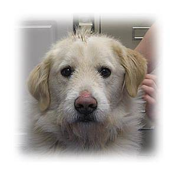
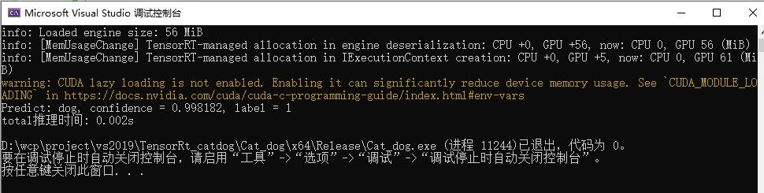

# TensorRT_dog_cat
基于TensorRT简单的猫狗识别分类

## （1）开发环境

> VS2019、TensorRT-8.5.1.7、Opencv440

环境配置：（小弟的博客） https://blog.csdn.net/caip12999203000/article/details/129412394

> **下载模型：**（将下载的模型文件直接放在项目目录下面）
>
> 网盘链接：https://pan.baidu.com/s/1b3r6P6tfu5RJwTZwj77rSQ 提取码：tb6n

## （2）结果展示

## (3) 性能对比（推理时间）

- Openvino项目：https://github.com/caip1299920300/Openvino_dog_cat

> 同一张图片，尺寸为224x224

| 实现类型           | 预测时间（单位/s） |
| ------------------ | ------------------ |
| Pytorch-gpu        | 0.029              |
| Pytorch-cpu        | 0.079              |
| openvino（python） | 0.023              |
| openvino（c++）    | 0.048              |
| TensorRT（python） | 0.005              |
| TensorRT（c++）    | 0.002              |

